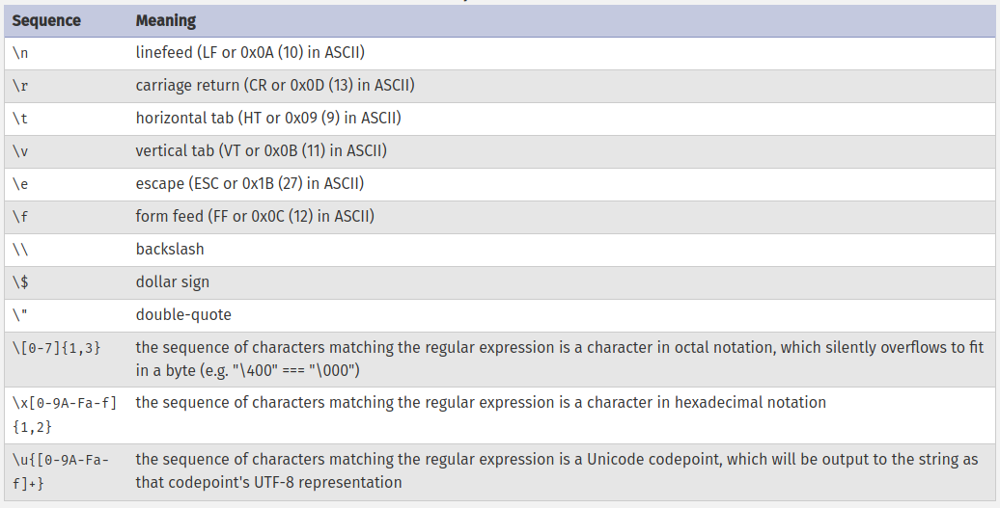
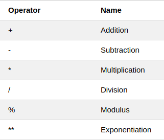
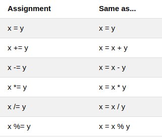
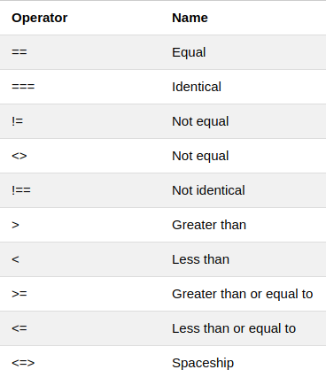
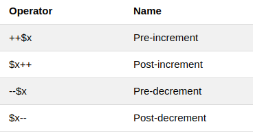
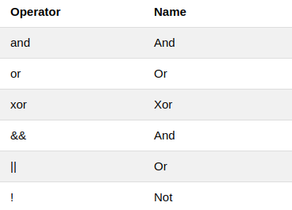
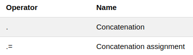
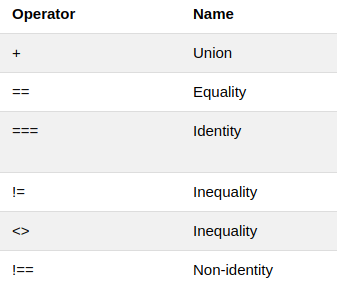
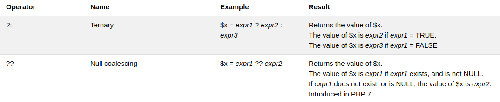

# PHP

## Syntax

- Starts with `<?php`
- Ends with `?>`

  ```php
  <?php
  // PHP code goes here
  ?>
  ```

- Every php statement ends with `;`

  ```php
  <?php
    echo "Hello World";
  ```

- Keywords are not case sensitive
  ```php
  <?php
    ECHO "Hello World";
  ```
- Variables are `CASE SENSITIVE`
- Comments
  - Single line comments
    ```php
    <?php
      // This is a single-line comment
      # This is also a single-line comment
    ```
  - Multi line comments
    ```php
    <?php
      /*
      This is a multiple-lines comment block
      that spans over multiple
      lines
      */
    ```

## Data Types

- String
- Integer
- Float (also called double)
- Boolean
- Array
- Object
- NULL
- Resource

## Variables

- Variable starts with a `$` sign
  ```php
  <?php
    $name = "John Doe";
    $age = 25;
    $height = 5.7;
    $isVerified = true;
  ```
- Must start with `letter` or `_`
- Must not start with `number`
- Can only have `alpha-numeric` characters and `_`
- `VARIABLE NAMES ARE CASE SENSITIVE`

## Variable scopes

- Global
- Local
- Static

```php
<?php

  $name = "John Doe";

  function sayName()
  {
    global $name;   # need to use global keyword, for using a global variable inside a fn.
    echo "My name is $name";
  }

```

- Changing global variable

```php
<?php
  #... previous code snippet here
  function changeName($newName)
  {
    $GLOBALS['name'] = $newName;
    sayName();
  }

  changeName('Patrick Jane');
```

## Standard output

- `echo`
- `print`
- String interpolation

  ```php
  <?php
    $name = "John Doe";
    $age = 24;

    echo "My name is " . $name . " and I'm " . $age . " years old\n";
    echo "My name is $name and I'm $age years old\n";
    // echo 'My name is $name'; // this won't work; string interpolation only works with double quotes
    print "My name is " . $name . " and I'm " . $age . " years old\n";
    print "My name is $name and I'm $age years old\n";
  ```

  - output

  ```output
  My name is John Doe and I'm 24 years old
  My name is John Doe and I'm 24 years old
  My name is John Doe and I'm 24 years old
  My name is John Doe and I'm 24 years old
  ```

## Strings

- strlen()
- str_word_count()
- strrev()
- strpos()
- str_replace()
- strval($variable) // converts to string
- settype($variable, `type`) // changes $variable's dataType to `type`
- substr()
- substr_replace()
- strcmp()
- strcasecmp()
- strtoupper()
- ucfirst()
  

## Number

- is_int()
- is_float()
- is_finite()
- (int)$variable // converting
- (float)$variable // converting
- is_nan()

## Operators

- ## Arithmetic operators
  
- ## Assignment operators
  
- ## Comparison operators
  
- ## Increment/Decrement operators
  
- ## Logical operators
  
- ## String operators
  
- ## Array operators
  
- ## Conditional assignment operators
  

## If.. Else.. Elseif

```php

if (condition) {
 #code to be executed if condition is true;
}

if (condition) {
  // code to be executed if condition is true;
} else {
  // code to be executed if condition is false;
}

if (condition) {
  // code to be executed if this condition is true;
} elseif (another_condition) {
  // code to be executed if condition is false and another_condition is true;
} else {
  // code to be executed if all conditions are false;
}

```

## Switch statement

```php
switch (n) {
  case label1:
    // code to be executed if n=label1;
    break;
  case label2:
    // code to be executed if n=label2;
    break;
  case label3:
    // code to be executed if n=label3;
    break;
  default:
    // code to be executed if n is different from all labels;
}
```

## Loops

### while

```php
while (condition is true) {
  // code to be executed;
}
```

### do...while

```php
do {
  // code to be executed;
} while (condition is true);
```

### for

```php
for (init counter; test counter; increment counter) {
  // code to be executed for each iteration;
}
```

### foreach

```php
foreach ($array as $value) {
  // code to be executed;
}
```

## Functions

```php
function functionName() {
  // code to be executed;
}
```

- functions can have default argument values
- functions may / may not return value
- can implement strict typing for arguments and return values
  ```php
    <?php
    declare(strict_types=1); // strict requirement
    function addNumbers(float $a, float $b) : float {
      return $a + $b;
    }
    echo addNumbers(1.2, 5.2);
    ?>
  ```
- During fn call, can pass params by name

  ```php
  function setPerson(string $name, int $age): string {
    // something
  }

  setPerson(age: 21,name: "John Doe");
  ```

## Array

```php
$cars = array("Volvo", "BMW", "Toyota");
$friends = ["Chandler","Joey", "Phoebe"];
```

### Associative arrays

```php
$todo = array('id' => 1, 'content' => 'Learn HTML', 'isCompleted' => false);

$todoList = [
  ["id" => 1, "content" => "Learn HTML", "isCompleted" =>  false],
  ["id" => 2, "content" => "Learn CSS", "isCompleted" =>  false],
  ["id" => 3, "content" => "Learn JavaScript", "isCompleted" =>  false],
  ["id" => 3, "content" => "Learn PHP", "isCompleted" =>  false],
];
```

### Sorting

| Method   | Description                        |
| -------- | ---------------------------------- |
| sort()   | ASC                                |
| rsort()  | DESC                               |
| asort()  | ASC (associative arrays: `value`)  |
| ksort()  | ASC (associative arrays: `key`)    |
| arsort() | DESC (associative arrays: `value`) |
| krsort() | DESC (associative arrays: `key`)   |

<hr>

## Super Globals

- `$GLOBALS`
- `$_SERVER`
- `$_REQUEST`
- `$_POST`
- `$_GET`
- `$_FILES`
- `$_ENV`
- `$_COOKIE`
- `$_SESSION`
